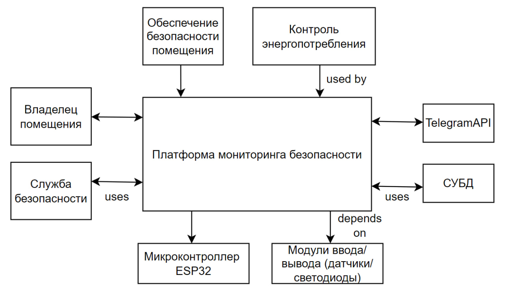

# Концепция проекта: «IoT-система охранной сигнализации и мониторинга активности»

### 1. Описание проблемы

* **Проблема:** Невозможность оперативно контролировать безопасность удаленных помещений (офисов, гаражей, серверных) и отсутствие мгновенного оповещения о несанкционированном доступе, подозрительном шуме или оставленном включенном свете.
* **Воздействует на:** Владельцев квартир, арендодателей, администраторов офисов, владельцев складов.
* **Результатом чего является:** Повышенный риск кражи имущества, вандализма, а также перерасход электроэнергии (если забыли выключить свет в пустом помещении на выходные).
* **Выигрыш от ПП:** Мгновенные push-уведомления в Telegram при обнаружении движения или аномального шума, возможность удаленно ставить/снимать помещение с охраны, дистанционное включение звуковой сирены (зуммера) для отпугивания нарушителей, а также ведение журнала событий (кто и когда заходил).

---

### 2. Назначение программного средства

* **Какие системы смогут применять ПС для решения своих задач?**
  Системы безопасности зданий, комплексные платформы «Умный дом», системы контроля энергопотребления (анализ того, когда горит свет в пустой комнате).

* **От каких систем/пользователей поступают входные данные ПС?**
  Аппаратные данные (триггеры движения, уровень шума, статус освещенности) поступают от микроконтроллера **ESP32** по сети. Пользовательские данные (команды: "Включить охрану", "Выключить охрану", "Запросить статус") поступают от администратора через **Telegram-бота**.

* **Кто/что использует результаты (Потребители)?**
  Владельцы помещений (получают алерты и читают логи в Telegram). Аппаратная часть — микроконтроллер (получает от Spring Boot сервера команду активировать зуммер или зажечь красный светодиод «Тревога»).

* **Какие сторонние системы/сервисы участвуют в процессе обработки данных?**
  **Telegram API** (интерфейс пользователя для управления и нотификаций), **СУБД** (PostgreSQL/MySQL для хранения логов событий, например: *"22:00 - Охрана включена"*, *"23:15 - Зафиксировано движение"*).

---

### 3. Контекстная диаграмма

