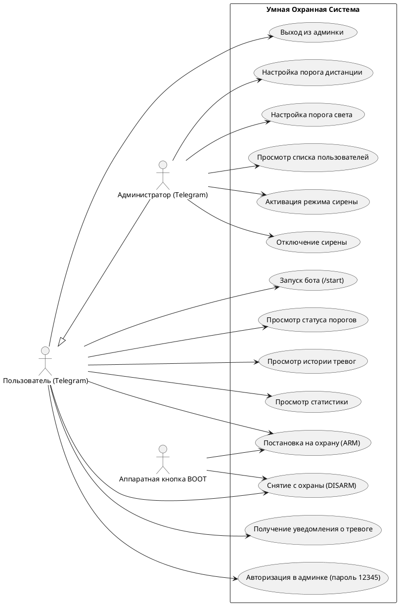
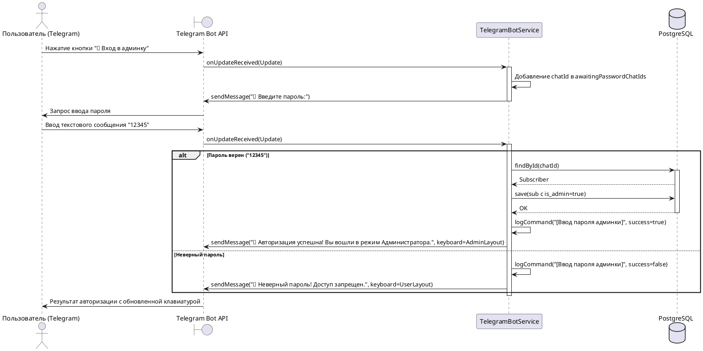
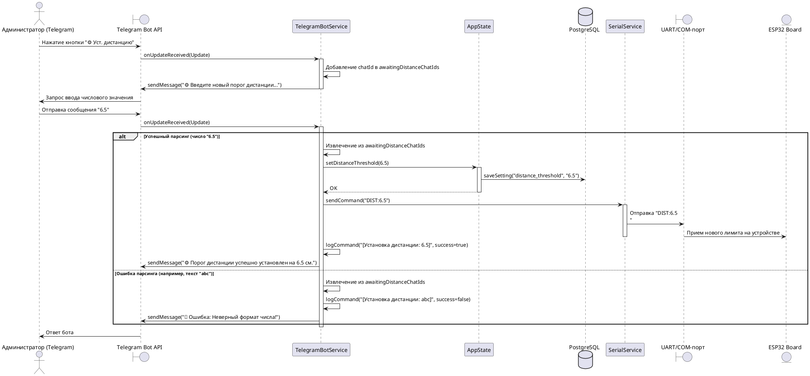
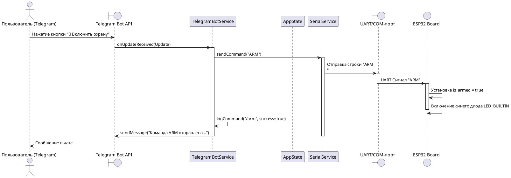
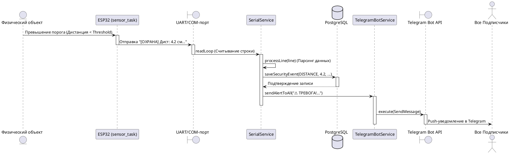
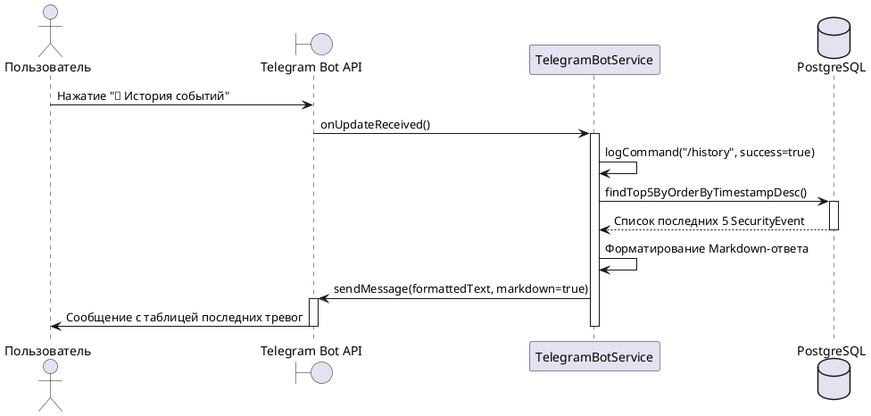
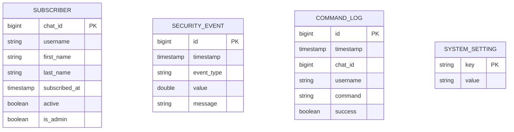
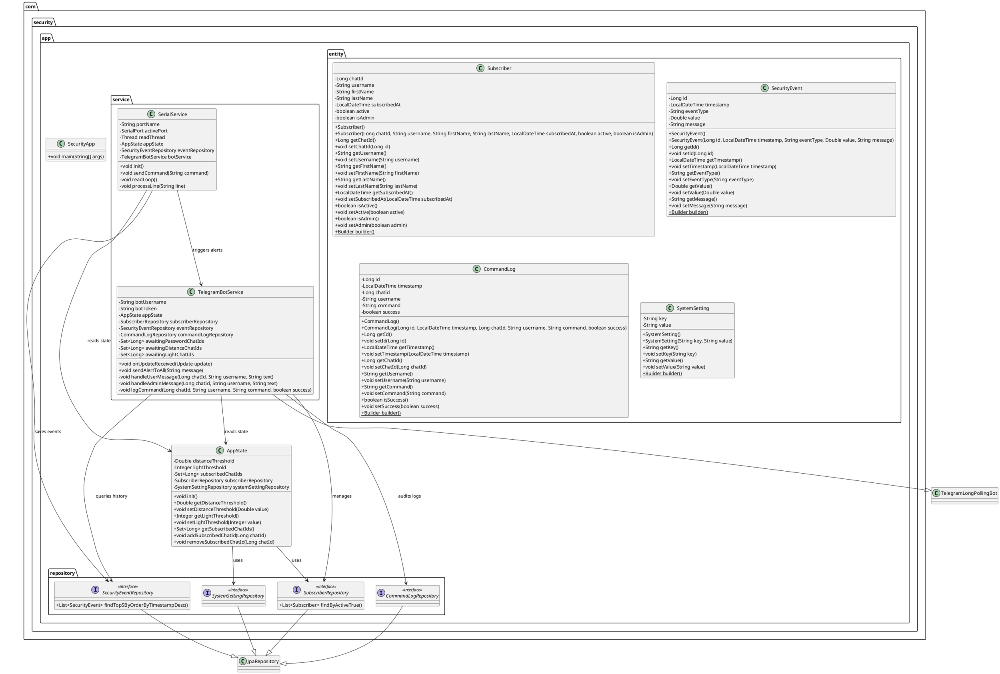

# Программные коды диаграмм для Draw.io / PlantUML

Ниже приведены исходные коды диаграмм в формате **PlantUML** и **Mermaid**.  
Вы можете легко импортировать их в **Draw.io** (меню *Устроить -> Вставить -> Advanced -> PlantUML / Mermaid*) или воспользоваться онлайн-редактором [PlantText](https://www.planttext.com/) для мгновенной генерации картинок и последующей вставки в Draw.io!

---

## 1. Диаграмма прецедентов (Use Case Diagram)
Описывает сценарии использования системы пользователем и администратором. Отражает разделение ролей: доступ к настройкам порогов датчиков и списку пользователей открывается только после успешного ввода пароля администратора.

### Код PlantUML:

---

## 2. Диаграмма последовательности: Авторизация Администратора
Показывает процесс ввода пароля `12345` и динамическое обновление интерфейса.

### Код PlantUML:

---

## 3. Диаграмма последовательности: Изменение настроек администратором (через кастомные кнопки)
Показывает пошаговый процесс изменения порога дистанции через специальное меню админки.

### Код PlantUML:

---

## 4. Диаграмма последовательности: Постановка на охрану (Arming Sequence)
Показывает процесс отправки команды ARM из Telegram на физическое устройство.

### Код PlantUML:

---

## 5. Диаграмма последовательности: Обработка сработки датчика (Alarm Sequence)
Показывает, как датчик на ESP32 вызывает тревогу, которая записывается в БД и прилетает в Telegram.

### Код PlantUML:

---

## 6. Диаграмма последовательности: Запрос истории тревог (History Request)
Показывает, как бот вытягивает данные о тревогах из БД по нажатию кнопки.

### Код PlantUML:

---

## 7. Диаграмма сущностей БД (ER-Diagram в формате Mermaid)
Для отображения структуры связей базы данных. Отражает новое поле `is_admin`.

### Код Mermaid:

---

## 8. Диаграмма классов Java (Java Class Diagram)
Описывает структуру классов серверного приложения на базе Spring Boot, их атрибуты, методы, связи и зависимости.

### Код PlantUML:

