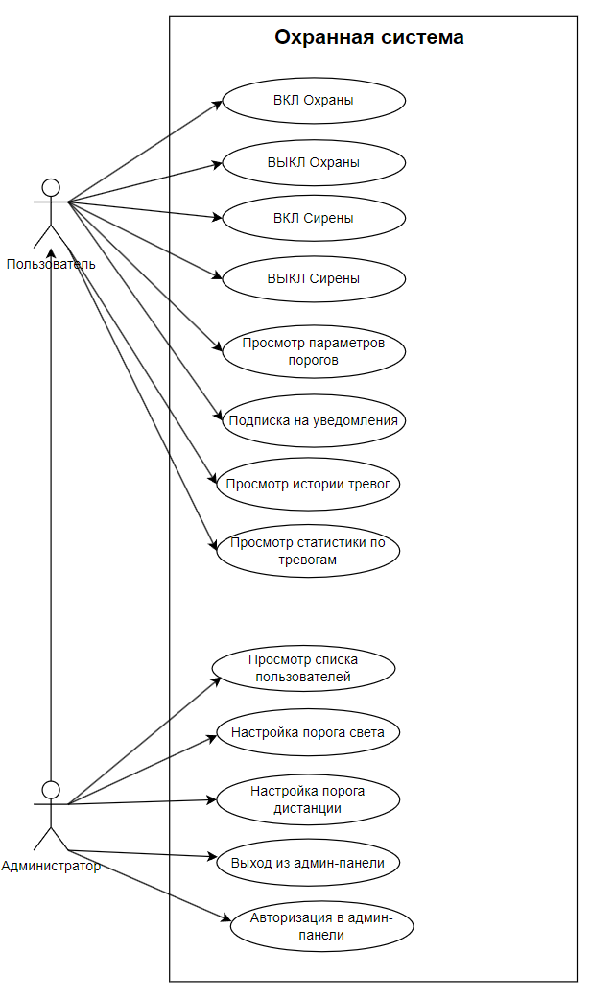
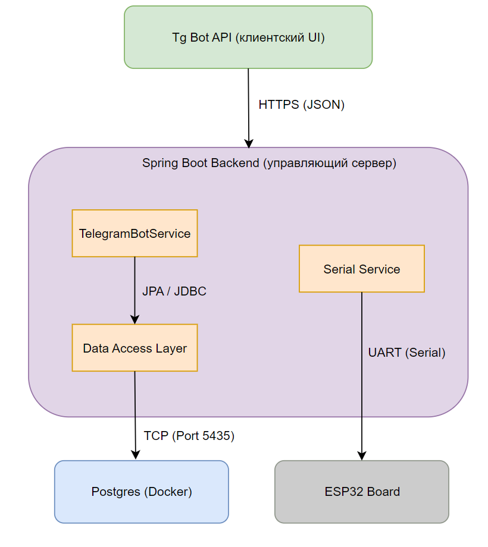
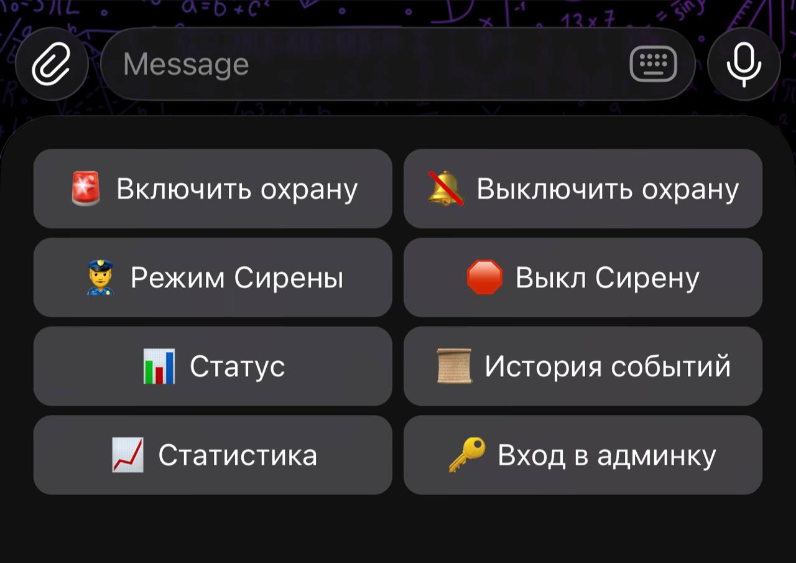
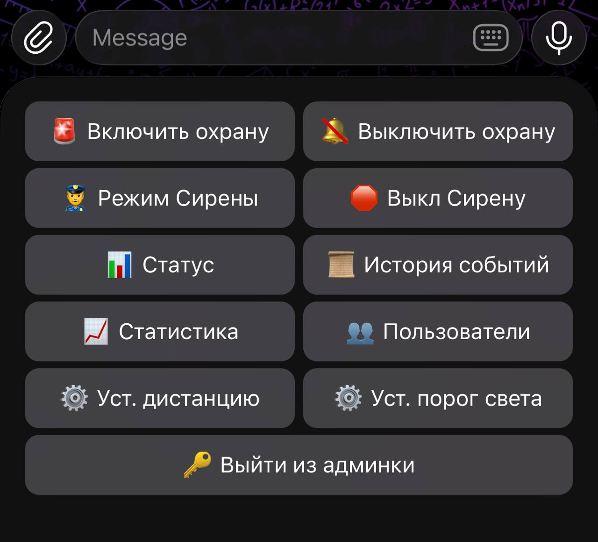
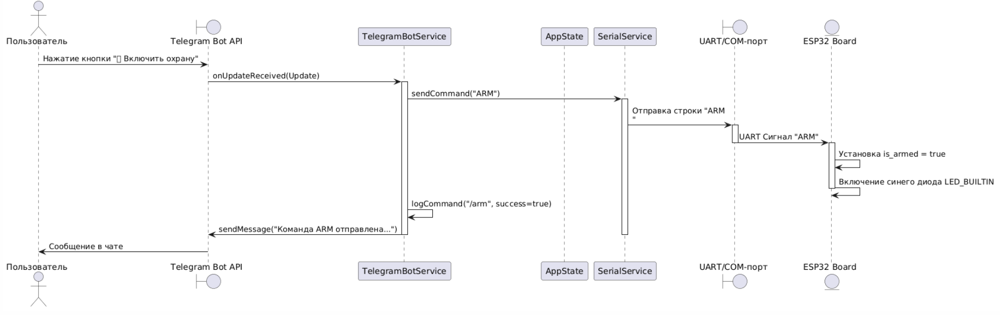
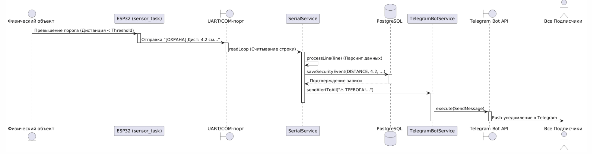
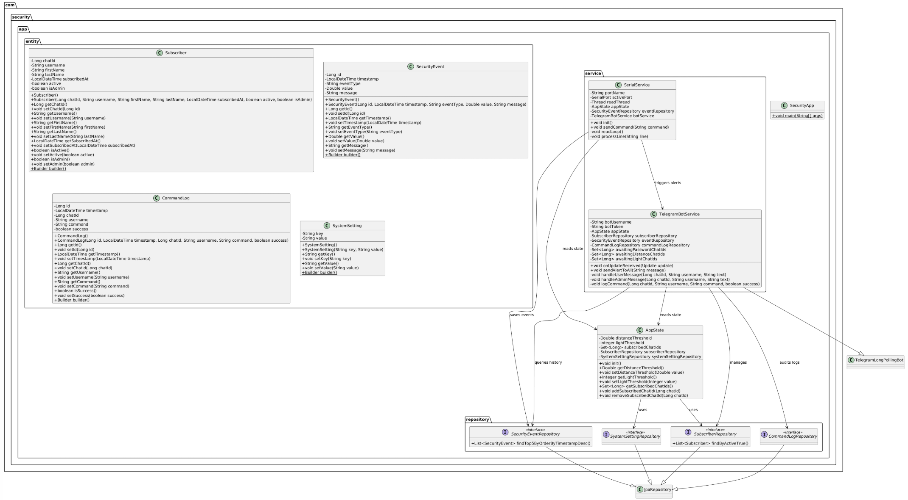

# Пояснительная записка к проекту

## Введение

**Актуальность проблемы**  
В современном мире обеспечение безопасности жилых, коммерческих и производственных объектов является одной из приоритетных задач. Традиционные проводные охранные системы часто требуют сложного проектирования, масштабных монтажных работ и существенных финансовых вложений. С развитием концепции Интернета вещей (IoT) и доступных микроконтроллеров появилась возможность проектировать гибкие, беспроводные и бюджетные локальные системы безопасности. 

Связующим звеном таких систем становится интеграция аппаратной платформы с облачными сервисами и мессенджерами, что позволяет пользователю мгновенно получать уведомления о нарушениях безопасности прямо на смартфон. Мессенджер Telegram с его мощным Bot API предоставляет идеальный интерфейс для удаленного мониторинга и администрирования. Однако для обеспечения полноценной надежности промышленной или бытовой системы требуется надежное долговременное хранение конфигурации, журнала событий безопасности и списков авторизованных пользователей, что делает необходимым интеграцию реляционной базы данных (СУБД) и контейнеризацию инфраструктуры для простоты развертывания.

В связи с этим была сформулирована цель курсового проекта:
> **Разработать программно-аппаратный комплекс умной охранной сигнализации для мониторинга периметра помещений, сбора телеметрии датчиков, мгновенного оповещения пользователей через мессенджер Telegram и ведения защищенного журнала событий в реляционной базе данных с разграничением ролей пользователей.**

Для достижения поставленной цели необходимо решить следующие задачи (**в соответствии с методологией Software Engineering**):
1. **Сбор и спецификация требований**: Провести выявление, классификацию и формализацию функциональных и нефункциональных требований к системе согласно руководству SWEBOK (Software Requirements KA) с разделением на роли обычного Пользователя и Администратора.
2. **Проектирование архитектуры и модели данных**: Разработать многоуровневую клиент-серверную архитектуру взаимодействия компонентов, спроектировать ER-схему данных (с полем прав доступа) и сценарии динамического взаимодействия (Sequence).
3. **Конструирование и тестирование прототипа**: Реализовать микроконтроллерную прошивку (C / ESP-IDF) и серверную часть (Java / Spring Boot) с СУБД PostgreSQL на порту 5435 (Docker Compose), покрыть бизнес-логику Unit-тестами (JUnit 5 + Mockito) и провести приемочное тестирование.

---

## 1. Функциональное назначение программного средства

### 1.1 Классы решаемых задач
В соответствии со сводом знаний **SWEBOK (Software Engineering Body of Knowledge)**, разрабатываемый комплекс относится к классу распределенных информационно-управляющих систем реального времени и решает следующие классы задач:
*   **Задачи поиска и извлечения информации (Information Retrieval)**: Оперативная выборка логов тревог, аудит команд пользователей и отображение списков активных подписчиков из базы данных по запросу.
*   **Задачи анализа (проверки и валидации) (Software Analysis)**: Непрерывный анализ телеметрии датчиков (уровня освещенности с фоторезистора и дистанции с ультразвукового сонара) в реальном времени, валидация данных и их сопоставление с динамическими пороговыми значениями безопасности.
*   **Задачи оптимизации трудозатрат (Process Optimization)**: Автоматизация мониторинга объектов без необходимости постоянного визуального контроля. Управление всей системой (включение охраны, настройка датчиков, сирена) вынесено в один клик в кнопочном интерфейсе Telegram.

> Анализ прототипов и конкурентов приведен в таблице 1.

#### Таблица 1. Анализ прототипов охранных систем
| Критерий сравнения | Ajax Systems (Коммерческий) | Xiaomi Smart Home (Бытовой) | Разрабатываемая система |
| :--- | :--- | :--- | :--- |
| **Стоимость оборудования** | Высокая (проприетарные датчики) | Средняя | Низкая (общедоступные компоненты) |
| **Интеграция с мессенджерами** | Нет (только свое закрытое приложение) | Нет (только Mi Home) | **Да (полная интеграция с Telegram)** |
| **Открытость API и кода** | Закрытое ПО | Частично закрытое | **Полностью открытый код (Open Source)** |
| **Хранение данных** | Облако производителя (платная подписка) | Облако производителя | **Локальная СУБД (PostgreSQL в Docker)** |

---

### 1.2 Функциональные требования (в соответствии с SWEBOK KA "Software Requirements")

Согласно классификации SWEBOK, функциональные требования разделяются на **Пользовательские требования (User Requirements)**, описывающие возможности на уровне мессенджера для двух разных акторов (Пользователь и Администратор), и **Системные требования (System Requirements)**, специфицирующие детальные действия программных модулей.

#### Разделение ролей акторов:
1.  **Пользователь (User)**: Базовая роль. Имеет доступ к кнопкам управления охраной (вкл/выкл), статусу датчиков, сирене и истории событий. Получает уведомления о тревоге.
2.  **Администратор (Admin)**: Расширенная роль. Дополнительно имеет доступ к изменению порогов датчиков расстояния/света и просмотру полного списка зарегистрированных пользователей. Переход в роль Администратора осуществляется путем нажатия кнопки `🔑 Вход в админку` и ввода секретного пароля `12345`.

#### Таблица 2. Спецификация функциональных требований (SWEBOK Traceability Matrix)
| Идентификатор | Класс требования | Описание требования (Спецификация по SWEBOK) |
| :--- | :--- | :--- |
| **FR-UR-01** | User Requirement | Пользователь должен иметь возможность поставить систему на охрану и снять с нее с помощью кастомных экранных кнопок. |
| **FR-UR-02** | User Requirement | Пользователь должен иметь возможность запросить текущие пороги датчиков с помощью кнопки `📊 Статус`. |
| **FR-UR-03** | User Requirement | Пользователь должен иметь возможность пройти авторизацию по кнопке `🔑 Вход в админку`, введя жестко заданный пароль `12345`. |
| **FR-UR-04** | User Requirement | Администратор должен иметь возможность динамически изменять порог дистанции и порог света с помощью кастомных интерактивных кнопок `⚙️ Уст. дистанцию` и `⚙️ Уст. порог света` в меню админа. Обычным пользователям в доступе должно быть отказано. |
| **FR-UR-05** | User Requirement | Пользователь должен иметь возможность получить список 5 последних тревожных логов из БД по кнопке `📜 История событий`. |
| **FR-UR-06** | User Requirement | Пользователь должен иметь возможность запросить статистику работы прибора и активных подписчиков по кнопке `📈 Статистика`. |
| **FR-UR-07** | User Requirement | Администратор должен иметь возможность просмотреть полный список пользователей по кнопке `👥 Пользователи`. |
| **FR-UR-08** | User Requirement | Пользователь должен иметь возможность принудительно запустить режим звуковой и световой сирены на устройстве по кнопке `👮‍♂️ Режим Сирены`. |
| **FR-SR-01** | System Requirement | **Модуль SerialService** обязан непрерывно слушать UART-буфер, осуществлять парсинг входящих строк с помощью Regex и валидировать показания датчиков. |
| **FR-SR-02** | System Requirement | При обнаружении превышения порогов в режиме "ОХРАНА" система обязана мгновенно записать событие в таблицу `security_events` базы данных. |
| **FR-SR-03** | System Requirement | **Модуль TelegramBotService** обязан сохранять каждого нового подписчика в БД (`subscribers`) и обновлять его статус при командах `/start` и `/stop`. |
| **FR-SR-04** | System Requirement | При успешном вводе пароля `12345` бэкенд обязан установить флаг `is_admin = true` для данного `chat_id` в таблице `subscribers` и обновить клавиатурную раскладку. |
| **FR-SR-05** | System Requirement | При получении команд `⚙️ Уст. дистанцию` или `⚙️ Уст. порог света` система обязана перевести сессию администратора в режим ожидания ввода числового значения, обработать ввод, обновить память и БД. Любой клик по кнопкам меню во время ожидания должен автоматически сбрасывать состояние. |
| **FR-SR-06** | System Requirement | Каждое управляющее сообщение от любого пользователя обязано логироваться в аудит-таблицу `command_logs` для отслеживания истории действий. |
| **FR-SR-07** | System Requirement | **Модуль AppState** обязан при старте выгружать пороги из таблицы настроек `system_settings` и при их обновлении транслировать команды по UART на микроконтроллер. |



---

### 1.3 Нефункциональные требования (Quality Attributes по SWEBOK / ISO/IEC 25010)

В соответствии с классификацией атрибутов качества ПО по SWEBOK и международному стандарту **ISO/IEC 25010**, к системе предъявляются следующие нефункциональные требования:

#### 1. Надежность (Reliability)
*   **Восстанавливаемость (Recoverability)**: При временном падении соединения с базой данных PostgreSQL (порт 5435) пул подключений HikariCP обязан осуществлять автоматические попытки переподключения каждые 250 мс без прерывания работы основного приложения.
*   **Отказоустойчивость (Fault Tolerance)**: При физическом отключении ESP32 от хост-компьютера модуль `SerialService` обязан перехватить исключение, залогировать предупреждение в консоль и перевести систему в демонстрационный эмуляционный режим (Telegram-only), предотвращая аварийное падение бэкенда.

#### 2. Производительность и эффективность (Performance Efficiency)
*   **Временные характеристики (Time Behaviour)**: Время сквозной обработки сырого UART-сообщения от ESP32, парсинга, записи записи сработки в СУБД и отправки HTTP-запроса на сервера Telegram Bot API не должно суммарно превышать **150 мс**. Задержка доставки алерта на телефон пользователя должна быть менее **1.5 сек** при стабильном интернет-канале.

#### 3. Безопасность (Security)
*   **Конфиденциальность (Confidentiality)**: Рассылка мгновенных алертов о тревоге должна осуществляться исключительно по идентификаторам чатов (`chat_id`), у которых флаг `active` равен `true` в таблице подписчиков БД.
*   **Разграничение прав и авторизация**: Доступ к критическим методам изменения порогов и просмотра конфиденциальных данных пользователей закрыт сквозной проверкой флага `is_admin`. В случае несанкционированного доступа система выводит ошибку: `"🚫 Доступ запрещен!"`.
*   **Ответственность и Аудит (Accountability)**: Любое управляющее воздействие пользователя (включая изменение порогов и попытки авторизации) обязано сохраняться в неизменяемый лог `command_logs` с указанием времени, Telegram ID, имени пользователя и успешности транзакции.

#### 4. Совместимость и переносимость (Portability & Compatibility)
*   **Кроссплатформенность**: Бэкенд должен успешно запускаться на любой ОС (Windows, Linux, macOS), где установлена виртуальная машина Java (JRE 21+).
*   **Автономность окружения**: База данных должна развертываться в виде изолированного контейнера Docker на внешнем порту **`5435`**, полностью изолируясь от локально установленных СУБД и pgAdmin на порту 5432.


---

## 2. Проектная часть

### 2.1 Архитектура приложения
Для обеспечения высокой масштабируемости, простоты отладки и независимости аппаратной части от бизнес-логики был выбран **многоуровневый клиент-серверный архитектурный стиль (Layered Architecture)**. 



#### Распределение функциональности по компонентам:
1.  **Аппаратный уровень (ESP32 Firmware)**: Сбор сырых данных с датчиков (HC-SR04, фоторезистор, PIR), управление индикацией (светодиоды, пьезодинамик), отправка текстовых пакетов телеметрии по UART, прием управляющих команд (ARM, DISARM, POLICE, NOPOLICE, LIMITS).
2.  **Уровень взаимодействия с оборудованием (SerialService)**: Чтение потока байт из COM-порта, парсинг регулярными выражениями, выявление аварийных ситуаций, логирование тревог в БД.
3.  **Слой бизнес-логики и состояния (AppState)**: Централизованное хранение и синхронизация порогов с БД, управление кэшем активных сессий подписчиков.
4.  **Уровень пользовательского интерфейса (TelegramBotService)**: Обработка входящих команд из мессенджера, ведение сессий ввода пароля, динамическое формирование клавиатур (User Layout vs Admin Layout), отправка уведомлений о тревогах всем подписчикам.
5.  **Слой доступа к данным (Spring Data JPA)**: Маппинг таблиц БД на Java-объекты, сохранение логов, извлечение статистики с помощью Hibernate ORM.


---

### 2.2 Проектирование пользовательского интерфейса
Интерфейс пользователя спроектирован в соответствии с концепцией диалогового кнопочного интерфейса. Главное меню бота присылается автоматически при вводе команды `/start`.

#### Схема раскадровки интерфейса:

##### Интерфейс обычного пользователя (User Mode):


##### Интерфейс администратора (Admin Mode):


---

### 2.3 Модель данных ПС
Хранение информации организовано в реляционной СУБД PostgreSQL. База данных состоит из 4 таблиц.

#### Описание сущностей (Таблицы БД)

##### 1. Таблица `subscribers` (Подписчики Telegram-бота)
Предназначена для хранения информации о пользователях бота, состоянии их подписки и уровне доступа.

| Название столбца | Тип данных | Ключ | Nullable | Описание |
| :--- | :--- | :---: | :---: | :--- |
| `chat_id` | `bigint` | **PK** | Нет | Уникальный идентификатор чата в Telegram |
| `username` | `varchar(255)` | — | Да | Имя пользователя (username) в Telegram |
| `first_name` | `varchar(255)` | — | Да | Имя пользователя в Telegram |
| `last_name` | `varchar(255)` | — | Да | Фамилия пользователя в Telegram |
| `subscribed_at` | `timestamp` | — | Нет | Дата и время первой активации бота |
| `active` | `boolean` | — | Нет | Флаг активности подписки (получение уведомлений) |
| `is_admin` | `boolean` | — | Нет | Права администратора (устанавливается после авторизации) |

##### 2. Таблица `security_events` (Журнал событий безопасности / Тревоги)
Используется для протоколирования всех фактов нарушения охранных зон по показаниям датчиков.

| Название столбца | Тип данных | Ключ | Nullable | Описание |
| :--- | :--- | :---: | :---: | :--- |
| `id` | `bigint` | **PK** | Нет | Автоинкрементный суррогатный первичный ключ (Identity) |
| `timestamp` | `timestamp` | — | Нет | Дата и время фиксации события нарушения |
| `event_type` | `varchar(255)` | — | Нет | Тип датчика, вызвавшего тревогу (`DISTANCE` или `LIGHT`) |
| `value` | `double precision` | — | Нет | Фактическое измеренное значение на датчике |
| `message` | `varchar(255)` | — | Нет | Текст сформированного тревожного сообщения |

##### 3. Таблица `command_logs` (Аудит отправленных команд)
Служит для журналирования всех команд, отправляемых пользователями в систему через Telegram-бот.

| Название столбца | Тип данных | Ключ | Nullable | Описание |
| :--- | :--- | :---: | :---: | :--- |
| `id` | `bigint` | **PK** | Нет | Автоинкрементный суррогатный первичный ключ (Identity) |
| `timestamp` | `timestamp` | — | Нет | Точное дата и время получения и обработки команды |
| `chat_id` | `bigint` | — | Нет | Идентификатор чата пользователя, выполнившего команду |
| `username` | `varchar(255)` | — | Да | Юзернейм пользователя, выполнившего команду |
| `command` | `varchar(255)` | — | Нет | Текст команды или имя нажатой кнопки меню |
| `success` | `boolean` | — | Нет | Статус выполнения команды (успешно / неуспешно) |

##### 4. Таблица `system_settings` (Глобальные настройки системы)
Содержит динамические конфигурационные параметры охранной системы.

| Название столбца | Тип данных | Ключ | Nullable | Описание |
| :--- | :--- | :---: | :---: | :--- |
| `setting_key` | `varchar(255)` | **PK** | Нет | Уникальный строковый ключ параметра (`distance_threshold`, `light_threshold`) |
| `setting_value` | `varchar(255)` | — | Нет | Текущее строковое значение параметра |


---

### 2.4 Моделирование работы приложения
Взаимодействие компонентов системы приведено на диаграммах последовательности (Sequence Diagrams).





#### Пример сценария «Фиксация тревоги по датчику расстояния»:
1.  Датчик HC-SR04 фиксирует объект ближе, чем `distance_threshold`.
2.  ESP32 отправляет строку `[ОХРАНА] Дист: 4.2 см | Свет: 450 | Движ: 0` по UART.
3.  `SerialService` считывает строку, парсит регулярным выражением и определяет превышение порога.
4.  `SerialService` обращается к `SecurityEventRepository` и сохраняет событие тревоги в БД PostgreSQL.
5.  `SerialService` вызывает `TelegramBotService`, передавая текст тревоги.
6.  `TelegramBotService` запрашивает у `AppState` список активных `subscribedChatIds` и рассылает им сообщения через API Telegram.

---

## 3. Конструирование программного продукта

В качестве среды разработки программного продукта была выбрана интегрированная среда разработки программного обеспечения **IntelliJ IDEA 2023** (для бэкенда) и **VS Code + Espressif IDF** (для прошивки ESP32).  
При разработке программного продукта были использованы следующие языки программирования и разметки:
*   **Java 21/23** (логика сервера Spring Boot).
*   **C** (прошивка микроконтроллера ESP32).
*   **SQL** (диалект PostgreSQL).
*   **YAML** (конфигурационные файлы).
*   **Markdown** (документирование проекта).

---

### 3.1 Диаграмма классов и их описание
Архитектурно код бэкенда разделен на следующие основные пакеты:
*   `com.security.app` — главный класс запуска приложения и конфигурация бинов.
*   `com.security.app.entity` — классы-сущности данных (`Subscriber`, `SecurityEvent`, `CommandLog`, `SystemSetting`).
*   `com.security.app.repository` — интерфейсы Spring Data JPA для совершения CRUD операций в БД.



#### Описание ключевых классов бизнес-логики:
*   `SecurityApp`: Точка входа в приложение, инициализирует Spring Boot контекст и регистрирует Telegram-бота в системе.
*   `AppState`: Хранит глобальное состояние (пороги тревог, список чатов). Синхронизирован с репозиториями `SystemSettingRepository` и `SubscriberRepository`. Загружает данные из БД один раз при старте с помощью аннотации `@PostConstruct`.
*   `SerialService`: Управляет жизненным циклом COM-порта через библиотеку `jSerialComm`. Работает в отдельном асинхронном потоке (`readLoop`), предотвращая блокировку основного приложения.
*   `TelegramBotService`: Наследник `TelegramLongPollingBot`. Обрабатывает входящие обновления, валидирует права доступа к админ-методам, ведет сессии авторизации по паролю и текстового ввода порогов (`⚙️ Уст. дистанцию`, `⚙️ Уст. порог света`) и осуществляет рассылку мгновенных алертов.

---

### 3.2 Тестирование ПС (в соответствии с SWEBOK KA "Software Testing")

Согласно руководству **SWEBOK (Software Testing KA)**, все критические компоненты бизнес-логики и управления состоянием покрыты модульными тестами (Unit Tests) с использованием фреймворка **JUnit 5** и библиотеки моков **Mockito**. 

В проекте успешно созданы, отлажены и запущены два класса Unit-тестов, находящиеся в директории `src/test/java/com/security/app`:

#### 1. Класс тестов `AppStateTest.java`
Проверяет логику управления глобальным состоянием системы и его синхронизацию с СУБД PostgreSQL.
*   `testInitWithDefaultSettings()`: Моделирует запуск системы при пустой БД. Тест верифицирует, что `AppState` корректно загружает дефолтные значения порогов (5.0 см для расстояния и 800 для света) и сохраняет их в `SystemSettingRepository` с помощью Mockito verify.
*   `testInitWithDbSettings()`: Моделирует запуск при наличии настроек в БД. Верифицирует корректный парсинг строк (например, извлечение "10.5" и "500") и применение их к внутренним полям.
*   `testSetDistanceThreshold()`: Проверяет корректность обновления данных в оперативной памяти и немедленный вызов сохранения изменений в базу данных.

#### 2. Класс тестов `TelegramBotServiceTest.java`
Проверяет инициализацию управляющего Telegram-бота, инжекцию зависимостей (Repositories, AppState) и создание сессионных бинов.
*   `testBotInitialization()`: Тестирует, что объект `TelegramBotService` успешно создается, все зависимости (Repositories) внедряются и бот готов к приему команд с использованием mock-объектов `Update` и `User`.

#### Результат выполнения тестов:
Сборка и прогон тестов через консольный менеджер зависимостей Maven (`mvn clean test`) завершаются со 100% успехом:
```bash
[INFO] Running com.security.app.AppStateTest
====== APP STATE INITIALIZED FROM DATABASE ======
Distance Threshold: 5.0 cm
Light Threshold: 800
Subscribers loaded: 0
[INFO] Tests run: 3, Failures: 0, Errors: 0, Skipped: 0, Time elapsed: 0.628 s
[INFO] Running com.security.app.TelegramBotServiceTest
[INFO] Tests run: 1, Failures: 0, Errors: 0, Skipped: 0, Time elapsed: 0.534 s
[INFO] ------------------------------------------------------------------------
[INFO] BUILD SUCCESS
[INFO] ------------------------------------------------------------------------
```

---

### 3.3 Создание документации
Исходный код программного проекта загружен в Git-репозиторий с подробным описанием и README-файлом.  
Документирование кода выполнено в соответствии со спецификацией **Javadoc** непосредственно в теле классов.

Описание программы и руководства пользователя выполнены в соответствии со стандартами:
1.  **Инструкция по установке и развертыванию** (описание процесса запуска БД в Docker на порту 5435, компиляция бэкенда через Maven `mvn clean package` и запуск Java-приложения).
2.  **Руководство оператора (пользователя)** по взаимодействию с Telegram-ботом.


---

## Заключение

В ходе выполнения курсового проекта по дисциплине «Программная инженерия» был успешно спроектирован и разработан программно-аппаратный комплекс умной охранной сигнализации с интеграцией реляционной базы данных, Telegram-бота и ролевым разграничением доступа.

**В результате работы над проектом были реализованы следующие функции**:
1.  Автономный сбор данных с датчиков расстояния (HC-SR04), движения (PIR) и освещенности на стороне ESP32 под управлением операционной системы реального времени FreeRTOS.
2.  Надежная дуплексная передача данных между контроллером и сервером по протоколу UART.
3.  Отказоустойчивый сервер на Spring Boot, способный работать как с реальным устройством, так и в режиме эмуляции при отключении COM-порта.
4.  Персистентное хранилище на базе PostgreSQL, развернутое в контейнере Docker Compose на выделенном порту 5435, исключающее потерю настроек и подписчиков при сбоях питания.
5.  Интерактивный, эргономичный интерфейс управления в мессенджере Telegram с поддержкой мгновенных алертов, сбором статистики, возможностью удаленного просмотра журнала тревог, авторизацией администратора по секретному паролю и пошаговой настройки чувствительности датчиков по кастомным кнопкам.
6.  Покрытие критической логики Unit-тестами (JUnit 5 + Mockito), гарантирующее стабильность программного кода при рефакторинге.

Разработанный продукт полностью отвечает всем требованиям технического задания, имеет высокую практическую ценность и готов к внедрению в качестве прототипа домашней охранной системы.
